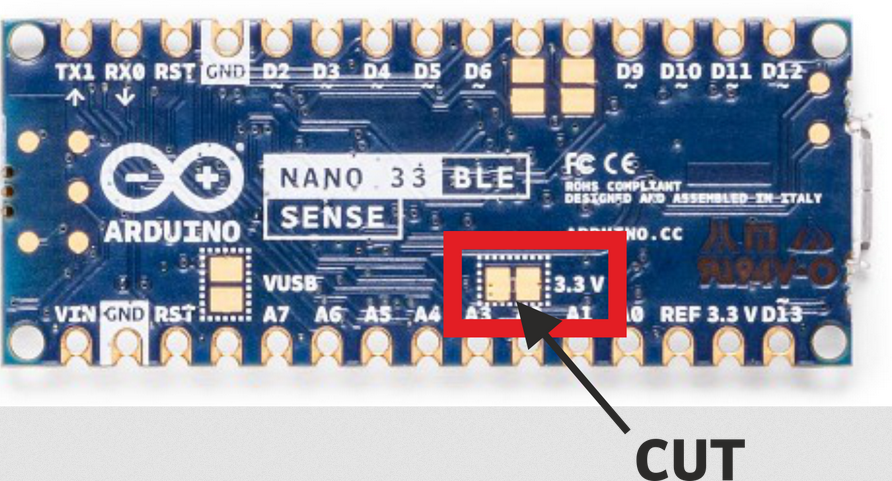
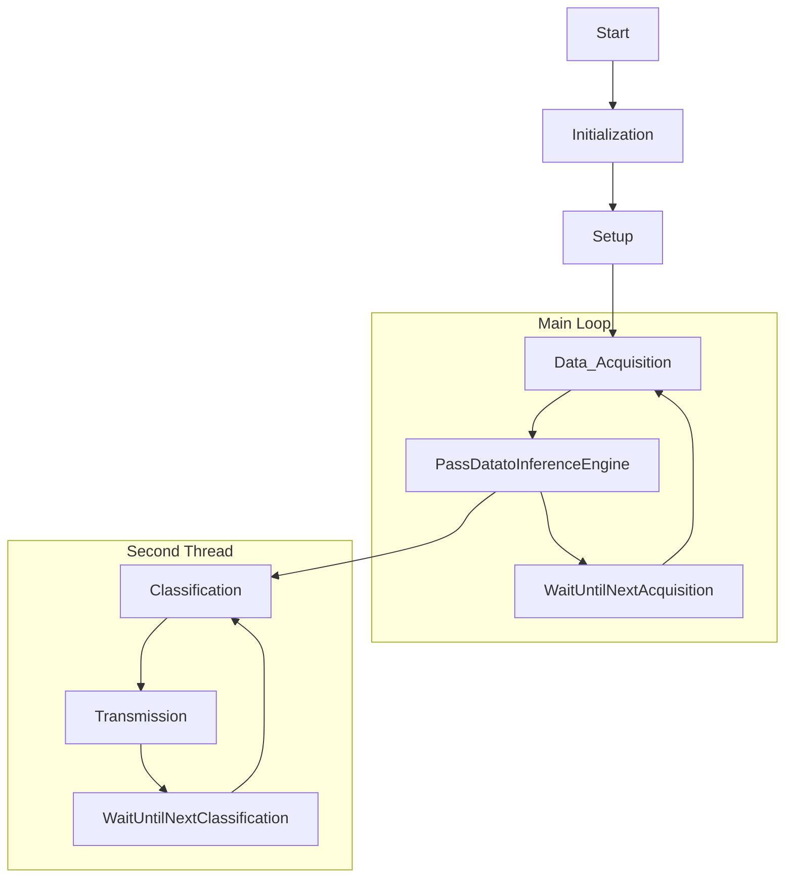

# NanoBle33Sense_LowPower
A code is provided to use the Arduino Nano Ble 33 Sense board in the lowest power mode possible. Also, there is an addional example is provided in order to use this example with a LoRa communication module and Edge Impulse TinyML neuronal network for embedded devices.
The code includes features such as Low-Power mode for optimizing power consumption and LoRa transmission for sending classification results wirelessly. This README provides comprehensive information about the code, its purpose, hardware requirements, usage instructions, and licensing.

## Code Features

1. **Low-Power Mode**: The code examples incorporate low-power optimizations to minimize energy consumption when running on an Arduino device. Low-power mode is especially useful for battery-powered applications to extend battery life.

2. **LoRa Transmission**: It enables the transmission of classification results using LoRa technology. LoRa (Long Range) communication is ideal for long-distance wireless data transfer, making it suitable for remote monitoring and IoT applications.

3. **Sensor Acquisition and Edge AI**: The code integrates with sensors, such as the LSM9DS1 accelerometer, to collect data for classification. In this specific code, we gather accelerometer data for inference.

## Hardware Modifications

In order to achieve the power consumption values listed in the following sections with Arduino Nano board and these codes, you need to provide an external 3.3V power supply. 
#### What happens if I feed the board using a 5V source as default (for example, with a USB power bank)? 
You will add a 9 mA power consumption value, which is 9 TIMES greater than the power consumption of this code.
#### Modifications
In order to be able to feed your board with an external 3.3V supply, you need to cut the following copper trace indicated in the picture and plug your external power pins (3.3V and 0V/ground) into the indicated pins:

 

#### Warning: Once you cut these pins, you will need to add an external cable in order to program your board again. To avoid this issue, my advice is to add a cut Arduino cable in the pins, allowing you to connect or disconnect the trace you cut before and program the board without an external source.

Cable plugged: Arduino Nano uses a 5V source.

Cable Unplugged: Arduino Nano will need a 3.3V external source.

 

## Edge Impulse Tiny ML

In order to run the TinyMl example, you need to install the Edge Impulse generated library (ei-ble_test_accelerometer-arduino62.5hz.zip) as detailed. This library holds a TinyML model that will use the accelerometer data in order to try to figure out if your device is not moving or detect (with terrible accuracy) the direction of the board movement (right, left, upwards, downwards). The aim of this example is just to show you how to integrate low-power modes, Edge-AI and LoRa, not to perform good detection. If you are able to run these examples and understand the code, I encourage you to train your own models!!.

## Lora Module
To use the Lora module, you need to download and install [Lora-E5 library](https://github.com/andresoliva/LoRa-E5) and have a [Seed Grove-Wio-E5 LoRa module](https://github.com/andresoliva/Grove-Wio-E5) plugged to your board.

## Power consumption values obtained

Here you can find the power consumption values measured for the two projects when the 

### For the low-power example
 * Shutdown: 5.2 uA
 * Delay:    320 uA

### For the low power example while using the Edge Ai, Lora module and accelerometer samples acquisition

Is important to notice that the values obtained are for the USB serial port disabled (for also the LoRa library )

 * Delay:   0.62 mA
 * 1.16 mA when all the functions of the code are on (with only the accelerometer turned on and acquiring data)
 * 1.19 mA  when using all the functionalities\

Also, the 1.19 mA of power consumption can be decomposed into the following :

* 320 uA corresponds to the bare power consumption of the microcontroller when is sleeping and doing nothing. 
* 240 uA corresponds to having the accelerometer turned ON at  62.5 Hz in normal mode (by changing the value the power consumption value can be decreased) and reading the values.
* 320 uA due to the fact that the wire library does not support the ".end" command. This means that you cannot turn off the circuitry associated with the I2C while you are not using it, therefore, implying a constant power consumption similar to the one you have when the Serial port has been init but is not used.
* 310 uA corresponds to the Edge impulse Tiny Ml inference model each second with a 62 ms inference time. 
* 31 uA corresponds to the LoRa module transmitting one message every 10 minutes with Spread Factor 7.

## Edge AI and Lora code Flowchart

This flowchart provides an overview of how the code operates, from initialization to continuous loop execution, inference, classification, and potential data transmission.

## License

This code is distributed under the MIT License. You can find the full terms and conditions in the LICENSE file provided in this repository.

