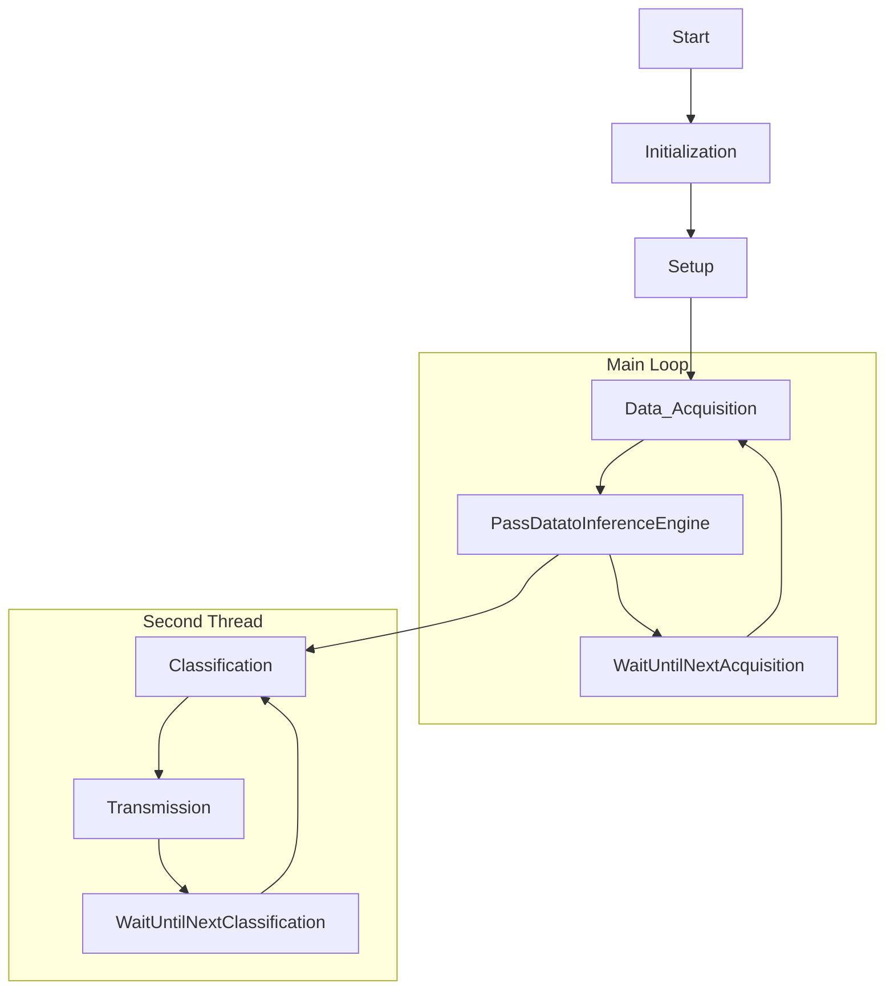

# NanoBle33Sense_LowPower
A code is provided to use the Arduino nano Nano Ble 33 Sense board into the lowest power mode possible. Also, there is an addional example is provided in order to use this example with a LoRa communication module and Edge Impulse TinyML neuronal network for embedded devices.

# Arduino Code Repository

Welcome to the Arduino Code Repository for [Your Project Name]. This repository hosts Arduino code designed to accomplish [brief description of your project]. The code includes features such as Low-Power mode for optimizing power consumption and LoRa transmission for sending classification results wirelessly. This README provides comprehensive information about the code, its purpose, hardware requirements, usage instructions, and licensing.

## Project Overview

[Provide a more detailed and complete overview of your project here. Explain what your project aims to achieve, its goals, and any context that might help readers understand its significance.]

## Code Features

The Arduino code in this repository offers the following key features:

1. **Low-Power Mode**: The code incorporates low-power optimizations to minimize energy consumption when running on an Arduino device. Low-power mode is especially useful for battery-powered applications to extend battery life.

2. **LoRa Transmission**: It enables the transmission of classification results using LoRa technology. LoRa (Long Range) communication is ideal for long-distance wireless data transfer, making it suitable for remote monitoring and IoT applications.

3. **Sensor Integration**: The code integrates with sensors, such as the LSM9DS1 accelerometer, to collect data for classification. In this specific code, we gather accelerometer data for inference.

## Hardware Requirements

To run this code successfully, you will need the following hardware components:

- [List and describe the specific hardware components required for your project. Include details such as sensor models, Arduino board types, and any additional peripherals.]

## Usage

Follow these steps to set up and use the Arduino code in this repository:

1. **Hardware Setup**:
   - [Explain how to physically set up the hardware components, including sensor connections and power supply.]

2. **Code Upload**:
   - Use the Arduino IDE or your preferred development environment to upload the code to your Arduino board.
   - [Provide any specific instructions for configuring the code, such as setting up libraries or modifying configuration parameters.]

3. **Operation**:
   - [Explain how to operate your project once the code is uploaded. Provide any necessary guidance for interacting with the hardware.]

4. **LoRa Transmission**:
   - [Detail the process of LoRa transmission, including how to receive and interpret the transmitted data on the receiving end if applicable.]

## Flowchart

Below is a flowchart illustrating the high-level logic and components of the Arduino code:

This flowchart provides an overview of how the code operates, from initialization to continuous loop execution, inference, classification, and potential data transmission.

## License

This code is distributed under the [License Name] license. You can find the full terms and conditions in the LICENSE file provided in this repository.

