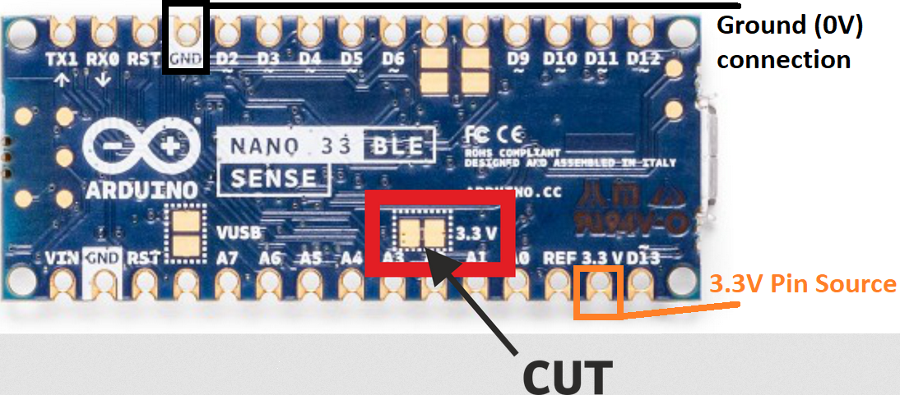

# NanoBle33Sense_LowPower
A code is provided to use the Arduino nano Nano Ble 33 Sense board into the lowest power mode possible. Also, there is an addional example is provided in order to use this example with a LoRa communication module and Edge Impulse TinyML neuronal network for embedded devices.
The code includes features such as Low-Power mode for optimizing power consumption and LoRa transmission for sending classification results wirelessly. This README provides comprehensive information about the code, its purpose, hardware requirements, usage instructions, and licensing.

## Power consumption values obtained
here
### For the low power example
 * Shutdown: 5.2 uA
 * Delay:    320 uA
### For the low power example while using the Edge Ai, Lora module and accelerometer sample acquisition

Is important to notice that the values obtained are for the USB serial port disabled (for also the LoRa library )

 * Delay:   0.62 mA
 * 1.16 mA when 
 * 1.19 mA  when using all the functionalities

Is important to notice that:

* 300 uA corresponds to the power consumed in order to run the inference model each second with a 62 ms inference time.
* 200 uA corresponds to have the accelerometer turned ON at  a 62.5 Hz in normal mode (this value can get decreased.
* 300 uA due to the fact that the wire library does not support an .end command. This means that you cannot turn off the circuitery associated with the I2C while you are not using it so there for 

## Code Features

1. **Low-Power Mode**: The code examples incorporates low-power optimizations to minimize energy consumption when running on an Arduino device. Low-power mode is especially useful for battery-powered applications to extend battery life.

2. **LoRa Transmission**: It enables the transmission of classification results using LoRa technology. LoRa (Long Range) communication is ideal for long-distance wireless data transfer, making it suitable for remote monitoring and IoT applications.

3. **Sensor Acquisition and Edge AI**: The code integrates with sensors, such as the LSM9DS1 accelerometer, to collect data for classification. In this specific code, we gather accelerometer data for inference.

## Hardware Modifications

In order to achieve power consumption with  Arduino Nano board and these codes, you need to provide an external 3.3V power supply. In order to be able to feed your board with an external 3.3V supply, you need to cut following copper trace indicated in the picture and plug your external power pins (3.3V and 0V/ground) to the indicated pins:

 

## Lora Module
To use the Lora module, you need to download and install [Lora-E5 library](https://github.com/andresoliva/LoRa-E5) and have a [Seed Grove-Wio-E5 LoRa module](https://github.com/andresoliva/Grove-Wio-E5) plugged to your board.

## Edge AI and Lora code Flowchart

This flowchart provides an overview of how the code operates, from initialization to continuous loop execution, inference, classification, and potential data transmission.

## License

This code is distributed under the MIT License. You can find the full terms and conditions in the LICENSE file provided in this repository.

